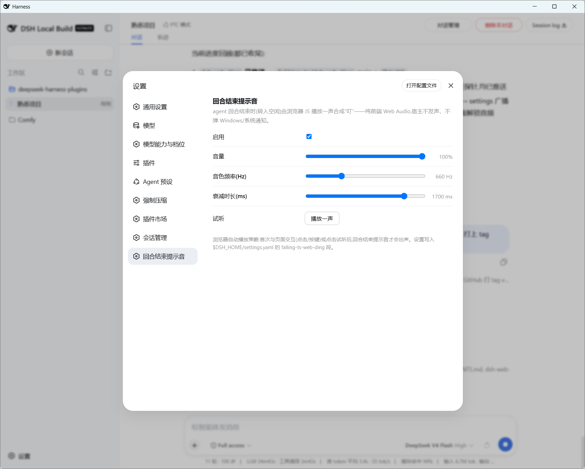

# dsh-web-ding

A DSH Cordis plugin that plays a **"ding"** in the **browser** the moment an
agent finishes (runs to idle). The sound is synthesized **entirely by front-end
JavaScript (Web Audio API)** — the Node/Host side never plays audio and no
Windows/system notification is used.

Built by following the architecture of
[dsh-force-compact](https://github.com/falling-ts/dsh-force-compact):
a pure-listener Host half + a browser client half connected by the official
`settings/document-updated` mirror channel.

## What it does

| Layer | What happens |
|-------|--------------|
| Host (`index.js` + `src/`) | Listens for the `agent/status` **idle transition** (all turns done, including sub-agents, before the next human turn; a fresh idle session that never ran, and repeated idle ticks, stay silent). Publishes `{ phase:'done', at, sessionId }` into the `falling-ts-web-ding` settings namespace. Never emits audio, never calls the OS. |
| Browser (`web/client.js`) | Mirrors the namespace live via `settingsScope`. On a strictly-newer `done` signal it synthesizes a short `ding` (three sine oscillators + exponential decay envelopes) with the Web Audio API and plays it through the tab. |

## Install

```bash
dsh plugin --profile web add github:falling-ts/dsh-web-ding
```

Requires the web app to ship the client bundle (the `dsh.client` declaration in
`package.json` does that automatically).

## Configuration (`falling-ts-web-ding` namespace, $DSH_HOME/settings.yaml)

| Field | Type | Default | Meaning |
|-------|------|---------|---------|
| `enabled` | boolean | `true` | Master switch (Host skips publishing when off). |
| `volume` | number 0..1 | `0.7` | Web Audio playback gain. |
| `freq` | number 80..4000 | `880` | Fundamental frequency of the ding (Hz). |
| `decayMs` | number 100..4000 | `900` | Tone decay length (ms). |

Every session's agent turn end (transition to idle) rings; repeated idle ticks of an already-idle session and brand-new sessions that never ran stay silent.

You can also adjust these from the **设置 → 回合结束提示音** panel, which
includes a "试听" (preview) button.

## Browser autoplay policy

Browsers block audio until a user gesture. The client warms the
`AudioContext` on the first pointer/key interaction (and on the preview
button), so: interact with the page once (or press 试听) and you will hear the
ding at every agent turn end. An audio context in a background tab may be
suspended by the browser itself — keep the tab visible to hear the tone.

## Development

```bash
# mount as a dev overlay (plain JS, no build step)
dsh web --patch $(pwd)/cordis.patch.yml   # if supported by your CLI
# or install from a local path
dsh plugin --profile web add /path/to/dsh-web-ding
```

See `AGENTS.md` for the plugin's own rules (pure Host listener, no backend
audio, no OS notification, only sanctioned settings-mirror channel to the
browser).

## Screenshots



*Agent round finishes: the browser client mirrors the `done` signal and
synthesizes a short "ding" through the tab; no backend audio, no OS
notification.*

---

## License

MIT
